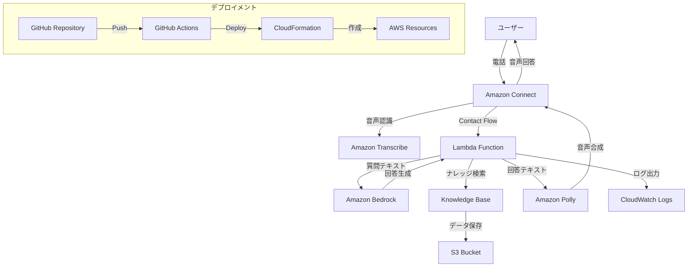

# 設計書

## 概要

Amazon Connect と Amazon Bedrock を活用した自動応答ヘルプデスクシステムのPoCの詳細設計。レジシステムのサポートを想定し、電話による問い合わせに対してナレッジベースから適切な回答を提供する。

## アーキテクチャ

### システム全体構成



### 環境構成

- **デバッグ環境**: `helpdesk-debug-{branch-name}`
- **ステージング環境**: `helpdesk-staging`
- **本番環境**: `helpdesk-production`

## コンポーネントと インターフェース

### 1. Amazon Connect Contact Flow

**目的**: 電話の受付から回答までの流れを制御

**設計詳細**:
- 着信時の初期案内（「お電話ありがとうございます。レジシステムのサポートです。」）
- 音声入力の受付（最大30秒）
- Lambda関数の呼び出し
- 回答の音声再生
- エラー時のフォールバック処理

**実装指示**:
```json
{
  "ContactFlowType": "CONTACT_FLOW",
  "Name": "AutomatedHelpdeskFlow",
  "Description": "レジシステム自動サポートフロー",
  "Content": "Contact Flowの詳細設定はCloudFormationテンプレートで定義"
}
```

### 2. Lambda Function (メイン処理)

**目的**: 音声認識結果の処理、Bedrock呼び出し、回答生成

**関数名**: `automated-helpdesk-processor`

**実装指示**:
```python
# ファイル: src/lambda/helpdesk_processor.py
import json
import boto3
import logging
from typing import Dict, Any

def lambda_handler(event: Dict[str, Any], context: Any) -> Dict[str, Any]:
    """
    Amazon Connectからの音声認識結果を処理し、
    Bedrockを使用して回答を生成する
    
    Args:
        event: Connect Contact Flowからの入力データ
        context: Lambda実行コンテキスト
    
    Returns:
        Connect Contact Flowに返す回答データ
    """
    # 実装内容:
    # 1. 入力音声テキストの取得
    # 2. ナレッジベース検索
    # 3. Bedrock Claude呼び出し
    # 4. 回答テキストの生成
    # 5. エラーハンドリング
    # 6. ログ出力
    # 7. 音声認識失敗時の聞き直し処理
```

**環境変数**:
- `KNOWLEDGE_BASE_ID`: BedrockナレッジベースのID
- `BEDROCK_MODEL_ID`: 使用するBedrockモデル（claude-3-5-sonnet-20241022 または amazon-nova-pro-v1:0）
- `LOG_LEVEL`: ログレベル（DEBUG/INFO/ERROR）
- `COST_LIMIT_DAILY`: 1日あたりのコスト上限（USD）

### 3. Amazon Bedrock Knowledge Base

**目的**: レジシステムのQ&Aデータの保存と検索

**設計詳細**:
- ベクトルデータベース: Amazon OpenSearch Serverless
- エンベディングモデル: Amazon Titan Embeddings G1 - Text
- データソース: S3バケット内のJSONファイル

**実装指示**:
```json
{
  "KnowledgeBaseName": "RegSystemHelpdesk",
  "Description": "レジシステムサポート用ナレッジベース",
  "DataSource": {
    "Type": "S3",
    "S3Configuration": {
      "BucketName": "helpdesk-knowledge-{environment}",
      "InclusionPrefixes": ["qa-data/"]
    }
  }
}
```

### 4. サンプルQ&Aデータ

**実装指示**:
```json
// ファイル: data/qa-knowledge.json
[
  {
    "id": "qa-001",
    "question": "レジの電源が入らない",
    "answer": "まず電源コードが正しく接続されているか確認してください。接続に問題がない場合は、電源ボタンを10秒間長押しして強制再起動を試してください。それでも解決しない場合は、ブレーカーを確認し、必要に応じて技術者にお問い合わせください。",
    "category": "電源トラブル",
    "keywords": ["電源", "起動しない", "電源が入らない", "電源入らない"]
  },
  {
    "id": "qa-002", 
    "question": "バーコードが読み取れない",
    "answer": "バーコードリーダーのレンズが汚れていないか確認してください。汚れている場合は、乾いた布で優しく拭き取ってください。また、バーコードが破損していないか、商品との距離が適切か確認してください。距離は5-15cm程度が最適です。",
    "category": "バーコードトラブル",
    "keywords": ["バーコード", "読み取れない", "スキャン", "読み込めない"]
  },
  {
    "id": "qa-003",
    "question": "レシートが印刷されない",
    "answer": "レシートプリンターの用紙が正しくセットされているか確認してください。用紙切れの場合は新しいロールに交換してください。用紙詰まりの場合は、電源を切ってから詰まった用紙を取り除いてください。プリンターヘッドが汚れている場合は、専用クリーナーで清拭してください。",
    "category": "プリンタートラブル",
    "keywords": ["レシート", "印刷されない", "プリンター", "用紙"]
  },
  {
    "id": "qa-004",
    "question": "釣り銭機のエラー",
    "answer": "釣り銭機にエラーコードが表示されている場合は、そのコードを確認してください。E01は硬貨詰まり、E02は紙幣詰まりを示します。詰まりを取り除いた後、リセットボタンを押してください。頻繁にエラーが発生する場合は、硬貨や紙幣の投入口を清掃してください。",
    "category": "釣り銭機トラブル",
    "keywords": ["釣り銭機", "エラー", "硬貨", "紙幣", "詰まり"]
  },
  {
    "id": "qa-005",
    "question": "売上データの確認方法",
    "answer": "メインメニューから「売上管理」を選択してください。日別売上は「日次売上」、月別売上は「月次売上」から確認できます。詳細な取引履歴を見たい場合は「取引履歴」を選択してください。データをUSBメモリにエクスポートすることも可能です。",
    "category": "売上管理",
    "keywords": ["売上", "データ", "確認", "履歴", "集計"]
  },
  {
    "id": "qa-006",
    "question": "システムの再起動方法",
    "answer": "まず現在の取引を完了させてください。メインメニューから「システム設定」→「システム再起動」を選択してください。緊急時は電源ボタンを10秒間長押しして強制終了後、再度電源を入れてください。再起動後は日付と時刻の設定を確認してください。",
    "category": "システム操作",
    "keywords": ["再起動", "リセット", "システム", "電源"]
  },
  {
    "id": "qa-007",
    "question": "商品登録ができない",
    "answer": "商品マスタに該当商品が登録されているか確認してください。新商品の場合は「商品管理」→「新規商品登録」から登録してください。JANコードが正しく入力されているか、価格設定に誤りがないかも確認してください。",
    "category": "商品管理",
    "keywords": ["商品登録", "商品マスタ", "JANコード", "新商品"]
  },
  {
    "id": "qa-008",
    "question": "割引設定の方法",
    "answer": "商品スキャン後、「割引」ボタンを押してください。パーセント割引の場合は割引率を、金額割引の場合は割引額を入力してください。会員割引やタイムセール割引は「特別割引」メニューから設定できます。",
    "category": "割引・特価",
    "keywords": ["割引", "特価", "セール", "会員割引"]
  }
]
```

## データモデル

### Contact Flow入力データ
```json
{
  "Details": {
    "ContactData": {
      "CustomerEndpoint": {
        "Address": "+81-XX-XXXX-XXXX"
      }
    },
    "Parameters": {
      "transcribedText": "レジの電源が入りません"
    }
  }
}
```

### Lambda応答データ
```json
{
  "response": "まず電源コードが正しく接続されているか確認してください...",
  "confidence": 0.85,
  "category": "電源トラブル",
  "processingTime": 2.3
}
```

## エラーハンドリング

### エラーパターンと対応

1. **音声認識失敗**
   - 対応: 「申し訳ございません。もう一度はっきりとお話しください。」
   - ログ: WARN レベル

2. **Bedrock API エラー**
   - 対応: 「現在システムが混雑しております。しばらくしてからおかけ直しください。」
   - ログ: ERROR レベル

3. **ナレッジベース検索結果なし**
   - 対応: 「申し訳ございませんが、該当する情報が見つかりませんでした。技術者におつなぎいたします。」
   - ログ: INFO レベル

4. **Lambda タイムアウト**
   - 対応: Connect側でタイムアウト処理
   - ログ: ERROR レベル

**実装指示**:
```python
# ファイル: src/lambda/error_handler.py
class HelpdeskError(Exception):
    """ヘルプデスク固有のエラー"""
    pass

def handle_error(error: Exception, context: str) -> Dict[str, Any]:
    """
    エラーを適切に処理し、ユーザー向けメッセージを生成
    
    Args:
        error: 発生したエラー
        context: エラーが発生したコンテキスト
    
    Returns:
        エラー応答データ
    """
    # エラータイプ別の処理実装
```

## テスト戦略

### 1. 単体テスト
- Lambda関数の各機能をモック化してテスト
- Bedrock APIレスポンスのモック化
- エラーハンドリングのテスト

### 2. 統合テスト
- Amazon Connect Contact Flowの動作確認
- 実際のBedrock APIとの連携テスト
- ナレッジベース検索の精度確認

### 3. E2Eテスト
- 実際の電話番号への発信テスト
- 音声認識から回答までの全フローテスト
- 各環境での動作確認

**実装指示**:
```python
# ファイル: tests/test_helpdesk_processor.py
import pytest
from moto import mock_bedrock
from src.lambda.helpdesk_processor import lambda_handler

@mock_bedrock
def test_successful_qa_response():
    """正常なQ&A応答のテスト"""
    # テスト実装

def test_error_handling():
    """エラーハンドリングのテスト"""
    # テスト実装
```

## CloudFormation テンプレート構成

### メインテンプレート
```yaml
# ファイル: infrastructure/main.yaml
AWSTemplateFormatVersion: '2010-09-09'
Description: 'Automated Helpdesk PoC - Main Stack'

Parameters:
  Environment:
    Type: String
    AllowedValues: [debug, staging, production]
    Description: 'Deployment environment'
  
  BranchName:
    Type: String
    Default: 'main'
    Description: 'Git branch name for debug environment'

Resources:
  # Amazon Connect Instance
  ConnectInstance:
    Type: AWS::Connect::Instance
    Properties:
      InstanceAlias: !Sub 'helpdesk-${Environment}'
      IdentityManagementType: 'CONNECT_MANAGED'
      
  # Lambda Function
  HelpdeskProcessor:
    Type: AWS::Lambda::Function
    Properties:
      FunctionName: !Sub 'automated-helpdesk-processor-${Environment}'
      Runtime: python3.11
      Handler: helpdesk_processor.lambda_handler
      Code:
        ZipFile: |
          # Lambda関数のコード
      Environment:
        Variables:
          KNOWLEDGE_BASE_ID: !Ref KnowledgeBase
          BEDROCK_MODEL_ID: 'claude-3-haiku-20240307'
          LOG_LEVEL: !If [IsProduction, 'INFO', 'DEBUG']
```

### GitHub Actions ワークフロー

**実装指示**:
```yaml
# ファイル: .github/workflows/deploy.yml
name: Deploy Automated Helpdesk

on:
  push:
    branches: [main, develop]
  pull_request:
    branches: [main]

jobs:
  test:
    runs-on: ubuntu-latest
    steps:
      - uses: actions/checkout@v4
      - name: Set up Python
        uses: actions/setup-python@v4
        with:
          python-version: '3.11'
      - name: Install dependencies
        run: |
          pip install -r requirements.txt
          pip install -r requirements-dev.txt
      - name: Run tests
        run: pytest tests/ -v
      - name: Run linting
        run: |
          flake8 src/
          black --check src/

  deploy-debug:
    if: github.event_name == 'pull_request'
    needs: test
    runs-on: ubuntu-latest
    steps:
      - name: Deploy to Debug Environment
        run: |
          aws cloudformation deploy \
            --template-file infrastructure/main.yaml \
            --stack-name helpdesk-debug-${{ github.head_ref }} \
            --parameter-overrides Environment=debug BranchName=${{ github.head_ref }}

  deploy-staging:
    if: github.ref == 'refs/heads/develop'
    needs: test
    runs-on: ubuntu-latest
    steps:
      - name: Deploy to Staging
        run: |
          aws cloudformation deploy \
            --template-file infrastructure/main.yaml \
            --stack-name helpdesk-staging \
            --parameter-overrides Environment=staging

  deploy-production:
    if: github.ref == 'refs/heads/main'
    needs: test
    runs-on: ubuntu-latest
    steps:
      - name: Deploy to Production
        run: |
          aws cloudformation deploy \
            --template-file infrastructure/main.yaml \
            --stack-name helpdesk-production \
            --parameter-overrides Environment=production
```

## セキュリティ設計

### IAMロール設計
```yaml
# Lambda実行ロール
LambdaExecutionRole:
  Type: AWS::IAM::Role
  Properties:
    AssumeRolePolicyDocument:
      Version: '2012-10-17'
      Statement:
        - Effect: Allow
          Principal:
            Service: lambda.amazonaws.com
          Action: sts:AssumeRole
    ManagedPolicyArns:
      - arn:aws:iam::aws:policy/service-role/AWSLambdaBasicExecutionRole
    Policies:
      - PolicyName: BedrockAccess
        PolicyDocument:
          Version: '2012-10-17'
          Statement:
            - Effect: Allow
              Action:
                - bedrock:InvokeModel
                - bedrock:Retrieve
              Resource: 
                - !Sub 'arn:aws:bedrock:${AWS::Region}:${AWS::AccountId}:knowledge-base/*'
```

### データ暗号化
- S3バケット: AES-256暗号化
- CloudWatch Logs: デフォルト暗号化
- Lambda環境変数: KMS暗号化

## 監視とアラート

### CloudWatch メトリクス
- Lambda関数の実行時間、エラー率
- Connect通話数、応答率
- Bedrockの呼び出し回数、レスポンス時間
- 通話品質メトリクス（応答時間、解決率）
- 顧客満足度指標（通話時間、再問い合わせ率）

### 通話品質・顧客満足度測定

**実装指示**:
```python
# ファイル: src/lambda/quality_metrics.py
import boto3
from datetime import datetime
from typing import Dict, Any

class QualityMetrics:
    def __init__(self):
        self.cloudwatch = boto3.client('cloudwatch')
    
    def record_call_metrics(self, call_data: Dict[str, Any]):
        """通話品質メトリクスを記録"""
        # 応答時間の記録
        response_time = call_data.get('response_time', 0)
        self.cloudwatch.put_metric_data(
            Namespace='Helpdesk/Quality',
            MetricData=[
                {
                    'MetricName': 'ResponseTime',
                    'Value': response_time,
                    'Unit': 'Seconds',
                    'Dimensions': [
                        {'Name': 'Environment', 'Value': call_data.get('environment', 'unknown')}
                    ]
                }
            ]
        )
        
        # 解決率の記録（回答が見つかったかどうか）
        resolution_status = 1 if call_data.get('answer_found', False) else 0
        self.cloudwatch.put_metric_data(
            Namespace='Helpdesk/Quality',
            MetricData=[
                {
                    'MetricName': 'ResolutionRate',
                    'Value': resolution_status,
                    'Unit': 'Count'
                }
            ]
        )
        
        # 通話時間の記録
        call_duration = call_data.get('call_duration', 0)
        self.cloudwatch.put_metric_data(
            Namespace='Helpdesk/Quality',
            MetricData=[
                {
                    'MetricName': 'CallDuration',
                    'Value': call_duration,
                    'Unit': 'Seconds'
                }
            ]
        )
```

### コスト管理とアラート設定

**実装指示**:
```yaml
# コスト上限アラート
CostBudgetAlarm:
  Type: AWS::Budgets::Budget
  Properties:
    Budget:
      BudgetName: !Sub 'Helpdesk-${Environment}-Budget'
      BudgetLimit:
        Amount: !If [IsProduction, 100, 20]  # 本番: $100/月, その他: $20/月
        Unit: USD
      TimeUnit: MONTHLY
      BudgetType: COST
      CostFilters:
        Service:
          - Amazon Connect
          - Amazon Bedrock
          - AWS Lambda
    NotificationsWithSubscribers:
      - Notification:
          NotificationType: ACTUAL
          ComparisonOperator: GREATER_THAN
          Threshold: 80  # 80%で警告
        Subscribers:
          - SubscriptionType: EMAIL
            Address: !Ref AlertEmail

# 高エラー率アラート
HighErrorRateAlarm:
  Type: AWS::CloudWatch::Alarm
  Properties:
    AlarmName: !Sub 'Helpdesk-HighErrorRate-${Environment}'
    MetricName: Errors
    Namespace: AWS/Lambda
    Statistic: Sum
    Period: 300
    EvaluationPeriods: 2
    Threshold: 5
    ComparisonOperator: GreaterThanThreshold
    AlarmActions:
      - !Ref SNSAlarmTopic

# 応答時間アラート
SlowResponseAlarm:
  Type: AWS::CloudWatch::Alarm
  Properties:
    AlarmName: !Sub 'Helpdesk-SlowResponse-${Environment}'
    MetricName: ResponseTime
    Namespace: Helpdesk/Quality
    Statistic: Average
    Period: 300
    EvaluationPeriods: 3
    Threshold: 15  # 15秒以上で警告
    ComparisonOperator: GreaterThanThreshold

# 解決率低下アラート
LowResolutionRateAlarm:
  Type: AWS::CloudWatch::Alarm
  Properties:
    AlarmName: !Sub 'Helpdesk-LowResolutionRate-${Environment}'
    MetricName: ResolutionRate
    Namespace: Helpdesk/Quality
    Statistic: Average
    Period: 3600  # 1時間
    EvaluationPeriods: 2
    Threshold: 0.7  # 70%を下回ったら警告
    ComparisonOperator: LessThanThreshold
```

## ナレッジベース更新戦略

### 定期更新（週次・月次）
- **スケジュール**: 毎週日曜日 2:00 AM（業務時間外）
- **更新内容**: 新しいQ&Aの追加、既存回答の改善
- **実装**: EventBridge + Lambda による自動更新

### 臨時更新（リリース連動）
- **トリガー**: システムリリース時の手動実行
- **更新内容**: 新機能に関するQ&A、変更された操作手順
- **実装**: GitHub Actions ワークフローでの手動トリガー

**実装指示**:
```yaml
# ファイル: infrastructure/knowledge-base-update.yaml
KnowledgeBaseUpdateFunction:
  Type: AWS::Lambda::Function
  Properties:
    FunctionName: !Sub 'helpdesk-kb-update-${Environment}'
    Runtime: python3.11
    Handler: kb_update.lambda_handler
    Environment:
      Variables:
        KNOWLEDGE_BASE_ID: !Ref KnowledgeBase
        S3_BUCKET: !Ref KnowledgeBaseBucket

# 定期更新スケジュール
KnowledgeBaseUpdateSchedule:
  Type: AWS::Events::Rule
  Properties:
    ScheduleExpression: 'cron(0 2 ? * SUN *)'  # 毎週日曜日 2:00 AM
    State: ENABLED
    Targets:
      - Arn: !GetAtt KnowledgeBaseUpdateFunction.Arn
        Id: KBUpdateTarget
```

## PoCフェーズ分け

### フェーズ1: 基本通話機能（1週間）
- Amazon Connect インスタンス作成
- 基本的なContact Flow（固定回答）
- 050番号取得と設定
- 通話テスト環境構築

### フェーズ2: AI応答機能（2週間）
- Bedrock Knowledge Base構築
- Lambda関数実装（AI応答）
- 音声認識・合成連携
- エラーハンドリング実装

### フェーズ3: 運用機能（1週間）
- 監視・アラート設定
- ログ分析機能
- コスト管理機能
- 品質メトリクス実装

### フェーズ4: デプロイメント自動化（1週間）
- CloudFormation テンプレート完成
- GitHub Actions ワークフロー
- 環境分離とCI/CD
- ドキュメント整備

この設計書により、Claude Codeは段階的な実装アプローチと具体的な技術的詳細を理解して、効率的にシステムを構築できるはずです。